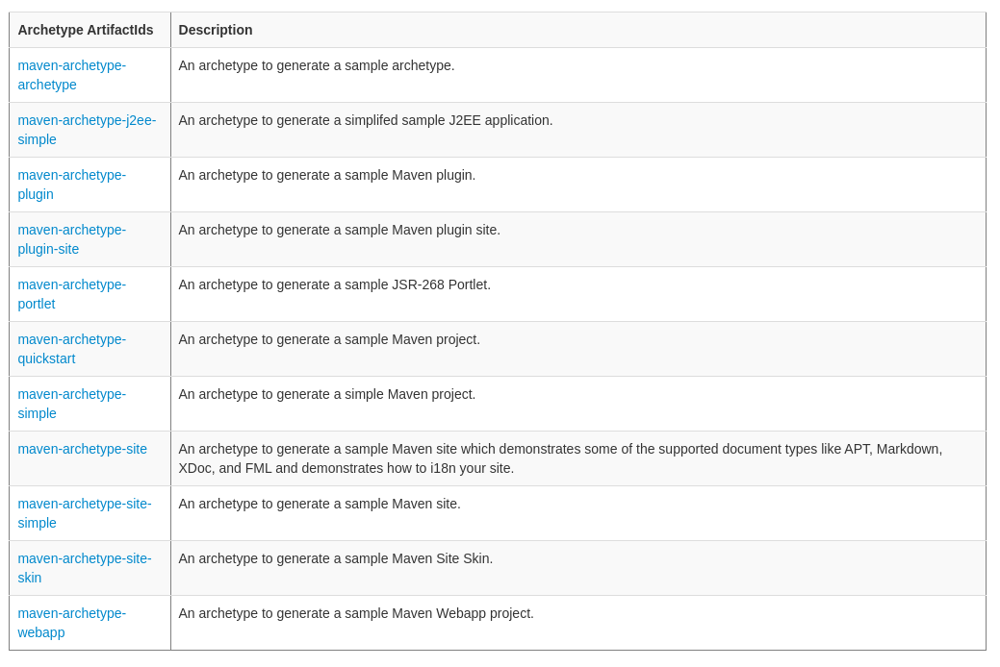
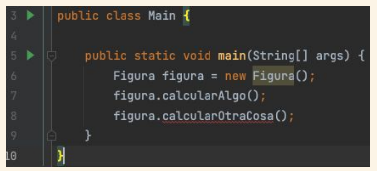
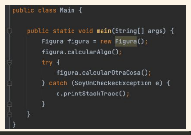
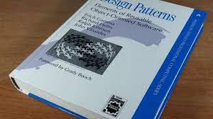
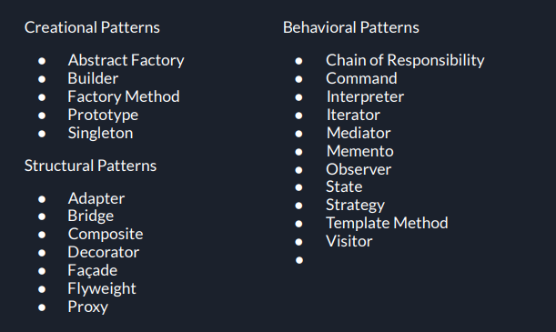

# Jar Files 


Los archivos JAR son formatos en los cuales podemos distribuir un programa escrito en Java utilizanod un unico archivo. Este esta diseñado para contener archivos de clases, multimedia y metadatos relacionados con el funcionamiento de la aplicación.

Además estos sirven tanto para empaquetar funcionalidades o librerías que pueden ser añadidas a un proyecto mas grande, como para ser ejecutadas independientemente.

## Estructura

Los JAR's contienen:

* Un archivo de manifiesto (MANIFEST.MF), el cual contiene los metadatos del archivo JAR, información de versión, autor, dependencias, entre otras cosas. Además este archivo puede especificar también el `entry point` y el `class path` de la app
* Y por otro lado, estan todas las clases que fueron compiladas con el archivo.


### Entry point

El punto de entrada no es más que la clase principal de nuestro programa, por ejemplo:

```java
public static void main(String[] args) {
    // Código de inicio de la aplicación
}
```

### Class Path

La ruta de clases es la ubicacion en la cual se encuentran las clases y recursos relacionados con la aplicación. En esta ubicación se encuentran las dependencias como las librerías externas o frameworks.

Esto puede ser mejorado, por ejemplo, usando ***Maven***.

## Compilación

Para crear un archivo JAR se debe utilizar el comand "jar" de la linea de comandos, de la siguiente forma:

```bash
jar -cf tup.jar ar/utn/frbb/tup/clase6/*.class
```

Tambien podemos compilar especificando un `entry point`:

```bash
jar cfe nombreArchivo.jar nombreClasePrincipal archivos
```

Podemos Actualizar:

```bash
jar -uf nombreArchivo.jar nuevosArchivos
```

Definir ClassPath al compilar:

```bash
java -cp ruta/clases:archivo.jar MiApp
```

# Maven


> "Maven es una poderosa herramienta de **gestión** y **construcción** de proyectos desarrollada por la Apache Software Foundation. Proporciona una **estructura** y un conjunto de **convenciones** para simplificar el proceso de construcción, gestión de dependencias y generación de proyectos en el desarrollo de software."

## POM

Maven se basa en el concepto de **Project Object Model (POM)**, que es un archivo **XML** que describe el proyecto y sus dependencias. Al utilizar Maven, se define un archivo POM para el proyecto, que especifica la estructura del proyecto, las dependencias, los complementos y las configuraciones necesarias.


Dentro de este archivo podemos destacar algunas etiquetas como:

* `artifactId`: El artifactId es el nombre único del proyecto o módulo dentro del grupo groupId
* `groupId`: El groupId representa el nombre base de la empresa, organización o grupo al que pertenece el proyecto. Por lo general, se utiliza un formato de dominio invertido como convención, como com.empresa.proyecto.
* `Version`
* `Packaging`: El packaging indica el método de empaquetado utilizado para el proyecto. Especifica el tipo de artefacto que se generará, como un archivo **JAR**, un archivo **WAR** (Web Archive), un archivo **ZIP**, etc. El valor por defecto es "jar".

A través del archivo POM, se pueden especificar las dependencias necesarias para el proyecto, y Maven se encarga de descargar automáticamente esas dependencias de los repositorios remotos y agregarlas al classpath del proyecto.

### Properties POM

Dentro del archivo `pom.xml` tambien podemos definir valores como los las `properties`, estos actuan como constantes que guardan valores que pueden ser utilizados en distintas partes del archivo.

Para definirlas utilizamos:

```xml
<properties>
    <my.property>value</my.property>
    <project.version>1.0.0</project.version>
</properties>
```

Para utilizarlas:

```xml
<version>${project.version}</version>
```

### Build POM

Es una sección dentro del archivo `pom.xml` (como `Properties`) que nos permite indicar como debe ser la construcción de la aplicación.

Es el conjunto de tareas y acciones que se llevan a cabo para compilar, empaquetar, probar y generar el resultado final del proyecto, como archivos JAR, WAR, ZIP, entre otros.

Estos resulatados se los conoce como **Artifacts**, los cuales son, los archivos resultantes de la construcción de un proyecto según las configuraciones y especificaciones establecidas en el archivo POM (Project Object Model).

```xml
<project>
  <!-- Otras secciones del archivo POM -->

  <build>
    <sourceDirectory>src/main/java</sourceDirectory>
    <testSourceDirectory>src/test/java</testSourceDirectory>
    <plugins>
      <plugin>
        <groupId>org.apache.maven.plugins</groupId>
        <artifactId>maven-compiler-plugin</artifactId>
        <version>3.8.1</version>
        <configuration>
          <source>1.8</source>
          <target>1.8</target>
        </configuration>
      </plugin>
      <plugin>
        <groupId>org.apache.maven.plugins</groupId>
        <artifactId>maven-jar-plugin</artifactId>
        <version>3.2.0</version>
        <configuration>
          <archive>
            <manifest>
              <mainClass>com.example.MainClass</mainClass>
            </manifest>
          </archive>
        </configuration>
      </plugin>
    </plugins>
  </build>

  <!-- Otras secciones del archivo POM -->
</project>

```
#### Goals en Build Process

Al momento de realizar el **build** aparecen las **goals**, que son acciones concretas que se ejecutan dentro de un objetivo (goal) determinado para alcanzar un resultado particular en el proyecto.

Al ejecutar el comando `mvn` seguido de un objetivo (goal), Maven ejecuta las tareas asociadas a ese objetivo y realiza las acciones definidas por los **plugins** correspondientes.

Maven utiliza un sistema de **plugins** para extender sus capacidades y ejecutar diferentes tareas durante la construcción. **Cada plugin define uno o más goals que representan las acciones que puede realizar.**

```bash
mvn compile
```

Cuando ejecutas mvn compile, Maven busca el **plugin** responsable de la compilación (por lo general, el plugin maven-compiler-plugin) y ejecuta el goal compile asociado a ese plugin. Esto compilará el código fuente del proyecto y generará los archivos de clase correspondientes.

Algunos de los **Goals** más comunes son:

* `clean:` Limpia los archivos generados en construcciones anteriores.
* `test:` Ejecuta las pruebas unitarias del proyecto.
* `package:` Empaqueta el proyecto en un formato específico (JAR, WAR, etc.).
* `install:` Instala el proyecto en el repositorio local para su uso como dependencia en otros proyectos.
* `deploy:` Despliega el proyecto en un repositorio remoto para su uso compartido.

# Archetypes

Los arquetipo es una plantilla o modelo que se utiliza como punto de partida para crear nuevos proyectos. Un arquetipo define la estructura básica, las dependencias y las configuraciones iniciales de un proyecto.


En lugar de comenzar un proyecto desde cero y tener que configurar manualmente todas las dependencias y la estructura del proyecto, se puede utilizar un arquetipo existente que proporcione una configuración predefinida y coherente.

Para crear un Archetype se utiliza:

```bash
mvn archetype:generate -DgroupId=com.example -DartifactId=myproject -DarchetypeArtifactId=maven-archetype-quickstart -DinteractiveMode=false
```

## Lista de Maven Archetypes



[https://maven.apache.org/archetypes/](https://maven.apache.org/archetypes/)

# Excepciones en Java

Una Excepcion es un error o una situación inesperada, de ahí su nombre, una situación Excepcional. Esta situacion se conoce como arrojar una Excepción `Thrown`.

En Java un error o excepcion es concebido como una clase (como todas las demas cosas en Java). Las excepciones provienen de la clase `Exception`, la cual a su vez, tiene clases extendidas como: `IOException`, `ArithmeticException`, `RuntimeException`, etc.


## Bloque Try Catch

En varios lenguajes de programación existe el bloque **try catch**, el cual sirve para manejar las excepciones.

```java
try {
    // Código propenso a generar excepciones
} catch (ExcepcionTipo1 e) {
    // Manejo de la excepción ExcepcionTipo1
} catch (ExcepcionTipo2 e) {
    // Manejo de la excepción ExcepcionTipo2
} finally {
    // Código a ejecutar siempre, independientemente de si se produce una excepción o no
}
```

Basicamente, colocamos en el bloque `try` un fragmento de código que nosotros creemos que puede generar algun error, y en el bloque `catch`, "atrapamos" ese error y ejecutamos otro código para manejar esta situacion excepcional. Algo a resaltar es que, si nos fijamos en el bloque `catch`, veremos como este **requiere** que especifiquemos el tipo de error que vamos a "atrapar".

Ademas podemos proveer a este sistema de un bloque `finally`, el cual se ejecutará independientemente del resultado.

## `throw` y `throws`

En java existen 2 palabras claves que se utilizan para arrojar errores, que si bien, a simple vista pueden verse muy similares, no lo son.

* `throw`: Este comando se utiliza para **arrojar manualmente** una expeción. Por ejemplo:
   ```java
   throw new java.lang.RuntimeException("Pasó algo .. todo mal");
   ```
* `throws`: Se utiliza para **indicar** que un método o función **podría** arrojar un determinado tipo de error. Por ejemplo:
    ```java
    public File buscarArchivo(String path) throws FileNotFoundException { …. }
    ```

## Expeciones Checked y Unchecked


* Rosa: Checked
* Verde: Unchecked
### Excepiciones Verificadas (Checked)

Son aquellas donde el compilador (o IDE) nos **obliga** a utilizar un `try/catch` ó indicar en la firma del método con un `throws` que ese método puede llegar a tirar una excepción. Algunas de las excepciones que entran dentro de este grupo son:

* **IOException:** Se produce cuando ocurre un error de entrada o salida, como problemas con archivos o sockets.
  
* **SQLException:** Se produce cuando ocurre un error relacionado con una base de datos o una consulta SQL.
  
* **ClassNotFoundException:** Se produce cuando no se puede encontrar una clase durante la carga dinámica.

### Expeciones No Verificadas (Unchecked)

Estas excepciones no requieren una declaración explícita o captura obligatoria. Son excepciones que se producen en tiempo de ejecución y se propagan automáticamente sin requerir manejo obligatorio. Algunos ejemplos son:

* **NullPointerException**: Se produce cuando se intenta acceder a un objeto nulo.
  
* **ArrayIndexOutOfBoundsException**: Se produce cuando se accede a un índice fuera de los límites de un arreglo.
  
* **ArithmeticException**: Se produce cuando se realiza una operación aritmética inválida, como la división por cero.

* **IllegalArgumentException**: Se produce cuando se pasa un argumento inválido a un método.

### Ejemplo visual



En este caso, el método `calcularAlgo()` arroja una excepción del tipo **Unchecked**, por ende no es necesario manejarlo.

Aunque, por otro lado, el método `calcularOtraCosa()`, si arroja una excepción del tipo **Checked**, y por ende si es necesario que se encuentre dentro de un bloque `try/catch`.



## Las Clases de Excepciones:


Volviendo a esta imagen, pasaremos a explicar que representa cada clase:

* `Throwable`: Es la clase base para todas las excepciones y errores en Java. Tanto las excepciones como los errores son subclases de Throwable. Esta clase proporciona los mecanismos básicos para el manejo y la propagación de excepciones y errores en un programa.

* `Exception`: Es una subclase directa de Throwable y representa una excepción general en Java. Esta clase es utilizada como base para las excepciones que ocurren durante la ejecución normal de un programa y que se pueden manejar y recuperar.

* `Error`: Es otra subclase directa de Throwable y representa condiciones anormales o irrecuperables en un programa. A diferencia de las excepciones, los errores generalmente no se manejan ni se recuperan, ya que indican problemas graves en la máquina virtual de Java (JVM) o en el entorno de ejecución

# Design Patterns

Los patrones de diseño son formas en las cuales uno encara un problema o situación en la programación, es un conjunto de practicas, metodologías y terminologías que se enfocan en crear softwares más flexibles, escalables y mantenibles.

Podriamos decir que son soluciones generales que estan compobadas y que ofrecen una serie de ventajas al implementarse en distintas soluciones.

## Design Patterns: Elements of Reusable Object-Oriented Software

el libro "Design Patterns: Elements of Reusable Object-Oriented Software" (Patrones de Diseño: Elementos de Software Orientado a Objetos Reutilizable), escrito por Erich Gamma, Richard Helm, Ralph Johnson y John Vlissides, también conocido como el "Gang of Four" (GoF). **El libro describe 23 patrones de diseño clásicos**, pero desde entonces se han propuesto y utilizado muchos otros patrones adicionales.



Cada patrón de diseño describe un problema específico en el diseño de software y proporciona una solución general que se puede adaptar y aplicar a diferentes contextos y lenguajes de programación.

### Categorias de Patrones de GoF

#### Patrones de Creación (Creational Patterns)

Los patrones de creación se centran en la creación de objetos de manera eficiente y flexible. Estos patrones abstraen el proceso de creación de objetos, ocultando los detalles específicos de implementación y proporcionando una interfaz común para la creación de diferentes tipos de objetos.

#### Patrones de Estructura (Structural Patterns):

Los patrones de estructura se centran en la composición y organización de objetos para formar estructuras más grandes y complejas. Estos patrones ayudan a definir relaciones entre clases y objetos, facilitando la creación de sistemas flexibles y mantenibles.

#### Patrones de Comportamiento (Behavioral Pattern)

Los patrones de comportamiento se centran en la interacción y comunicación entre objetos y la asignación de responsabilidades entre ellos. Estos patrones ayudan a definir cómo los objetos colaboran y se comunican entre sí para lograr un comportamiento específico.

### 23 Patrones de GoF



# UML Table


# Patrones Creacionales

## Abstract Factory


Este patron proporciona una interfaz para crear **familias de objetos relacionados**o dependientes sin especificar sus clases concretas. Permite crear objetos que siguen una determinada **interfaz** o contrato, pero que pueden tener diferentes **implementaciones según la familia** a la que pertenezcan.


### Como Funciona

Por ejemplo: Supongamos que estamos desarrollando un juego de estrategia en el que hay dos razas diferentes: humanos y orcos. Cada raza tiene su propio conjunto de unidades, como soldados, arqueros y magos. Queremos utilizar el patrón Abstract Factory para crear unidades de cada raza sin que el cliente tenga que conocer las clases concretas de las unidades.

* **Interfaz Abstracta de la Fábrica (Abstract Factory):** Se define una interfaz abstracta o una clase abstracta llamada "AbstractFactory" que declara los métodos para crear los objetos de una familia. Esta interfaz sirve como contrato para todas las fábricas concretas que se implementen.
  ```java
  public interface ArmyFactory {
    Soldier createSoldier();
    Archer createArcher();
    Mage createMage();
  }
  ```

* **Fábricas Concretas (Concrete Factories):** Se crean clases concretas que implementan la interfaz abstracta de la fábrica. Cada clase concreta representa una variante o familia específica de objetos y proporciona la implementación de los métodos de creación definidos en la interfaz abstracta.

  ```java
  public class HumanArmyFactory implements ArmyFactory {
      @Override
      public Soldier createSoldier() {
          return new HumanSoldier();
      }

      @Override
      public Archer createArcher() {
          return new HumanArcher();
      }

      @Override
      public Mage createMage() {
          return new HumanMage();
      }
  }

  public class OrcArmyFactory implements ArmyFactory {
      @Override
      public Soldier createSoldier() {
          return new OrcSoldier();
      }

      @Override
      public Archer createArcher() {
          return new OrcArcher();
      }

      @Override
      public Mage createMage() {
          return new OrcMage();
      }
  }
  ```

* **Jerarquía de Productos Abstractos (Abstract Product Hierarchy):** Se definen interfaces abstractas o clases abstractas para cada tipo de producto que se pueda crear. Estas interfaces o clases proporcionan una base común para todos los productos de una familia, pero no especifican las implementaciones concretas.

  ```java
  public interface Soldier {
    void attack();
  }

  public interface Archer {
      void shoot();
  }

  public interface Mage {
      void castSpell();
  }
  ```

* **Productos Concretos (Concrete Products):** Se crean clases concretas que implementan las interfaces o heredan de las clases abstractas definidas en la jerarquía de productos abstractos. Cada clase concreta representa una implementación específica de un producto en una familia determinada.
  ```java
  public class HumanSoldier implements Soldier {
    @Override
    public void attack() {
        System.out.println("Human soldier attacks!");
    }
  }

  public class HumanArcher implements Archer {
      @Override
      public void shoot() {
          System.out.println("Human archer shoots!");
      }
  }

  public class HumanMage implements Mage {
      @Override
      public void castSpell() {
          System.out.println("Human mage casts a spell!");
      }
  }

  public class OrcSoldier implements Soldier {
      @Override
      public void attack() {
          System.out.println("Orc soldier attacks!");
      }
  }

  public class OrcArcher implements Archer {
      @Override
      public void shoot() {
          System.out.println("Orc archer shoots!");
      }
  }

  public class OrcMage implements Mage {
      @Override
      public void castSpell() {
          System.out.println("Orc mage casts a spell!");
      }
  }
  ```
* **Relaciones entre las Fábricas y los Productos:** La fábrica abstracta y las fábricas concretas se encargan de crear los productos concretos correspondientes. Cada fábrica concreta produce objetos que pertenecen a la misma familia y son compatibles entre sí.

  ```java
  public class Main {
    public static void main(String[] args) {
        // Creamos la fábrica de la raza humana
        ArmyFactory humanFactory = new HumanArmyFactory();

        // Creamos las unidades de la raza humana
        Soldier humanSoldier = humanFactory.createSoldier();
        Archer humanArcher = humanFactory.createArcher();
        Mage humanMage = humanFactory.createMage();

        // Utilizamos las unidades de la raza humana
        humanSoldier.attack();
        humanArcher.shoot();
        humanMage.castSpell();

        // Creamos la fábrica de la raza orca
        ArmyFactory orcFactory = new OrcArmyFactory();

        // Creamos las unidades de la raza orco
        Soldier orcSoldier = orcFactory.createSoldier();
        Archer orcArcher = orcFactory.createArcher();
        Mage orcMage = orcFactory.createMage();

        // Utilizamos las unidades de la raza orco
        orcSoldier.attack();
        orcArcher.shoot();
        orcMage.castSpell();
    }
  }
  ```

## Builder Pattern

Se utiliza para construir objetos complejos paso a paso. Proporciona una forma de construir objetos con diferentes configuraciones sin exponer todos los detalles del proceso de construcción. El patrón Builder separa la construcción de un objeto de su representación, lo que permite crear diferentes representaciones utilizando el mismo proceso de construcción.


* **Producto (Product):** Es la clase compleja que se va a construir utilizando el patrón Builder. Puede ser una clase final o una interfaz. El producto tiene una serie de propiedades y características.

* **Builder (Constructor):** Es una interfaz o una clase abstracta que define los métodos necesarios para construir las diferentes partes del producto. Puede incluir métodos para establecer valores de las propiedades del producto.

* **Builder Concreto (Concrete Builder):** Son clases que implementan la interfaz o heredan de la clase abstracta del constructor. Cada builder concreto es responsable de construir un tipo específico de producto. Proporcionan implementaciones concretas para los métodos de construcción definidos en la interfaz del constructor.

* **Director (Director):** Opcionalmente, se puede utilizar un director para controlar el proceso de construcción utilizando el constructor. El director conoce los pasos necesarios para construir el objeto y utiliza el constructor para realizarlos en el orden correcto.

### Como se utiliza

```java
// Producto
public class Pizza {
    private String dough;
    private String sauce;
    private String topping;

    public void setDough(String dough) {
        this.dough = dough;
    }

    public void setSauce(String sauce) {
        this.sauce = sauce;
    }

    public void setTopping(String topping) {
        this.topping = topping;
    }

    public String getDescription() {
        return "Pizza with " + dough + " dough, " + sauce + " sauce, and " + topping + " topping.";
    }
}

// Builder
public interface PizzaBuilder {
    void buildDough();
    void buildSauce();
    void buildTopping();
    Pizza getPizza();
}

// Builder Concreto
public class MargheritaPizzaBuilder implements PizzaBuilder {
    private Pizza pizza;

    public MargheritaPizzaBuilder() {
        pizza = new Pizza();
    }

    @Override
    public void buildDough() {
        pizza.setDough("thin crust");
    }

    @Override
    public void buildSauce() {
        pizza.setSauce("tomato");
    }

    @Override
    public void buildTopping() {
        pizza.setTopping("cheese and basil");
    }

    @Override
    public Pizza getPizza() {
        return pizza;
    }
}

// Director
public class Waiter {
    private PizzaBuilder pizzaBuilder;

    public void setPizzaBuilder(PizzaBuilder pizzaBuilder) {
        this.pizzaBuilder = pizzaBuilder;
    }

    public Pizza getPizza() {
        return pizzaBuilder.getPizza();
    }

    public void constructPizza() {
        pizzaBuilder.buildDough();
        pizzaBuilder.buildSauce();
        pizzaBuilder.buildTopping();
    }
}

// Uso del patrón Builder
public class Main {
    public static void main(String[] args) {
        Waiter waiter = new Waiter();
        PizzaBuilder pizzaBuilder = new MargheritaPizzaBuilder();

        waiter.setPizzaBuilder(pizzaBuilder);
        waiter.constructPizza();
        Pizza pizza = waiter.getPizza();

        System.out.println(pizza.getDescription());
    }
}

```

## Factory Method


Este patron proporciona una interfaz para crear objetos, pero **delega** la responsabilidad de la **creación de objetos** a las **subclases**. Permite que una clase deferir la creación de objetos a las subclases, permitiendo así que las subclases decidan qué **clase concreta** de objeto crear.

### Factory Method VS Abstract Factory

***La principal diferencia entre el patrón Factory Method (Método de Fábrica) y el patrón Abstract Factory (Fábrica Abstracta) radica en su nivel de abstracción y complejidad.***

El patrón Factory Method se centra en la creación de un único producto concreto en cada subclase del Creador (Creator). Cada subclase del Creador tiene su propio Factory Method que devuelve una instancia de un producto específico. **Es adecuado cuando solo necesitas crear un tipo de objeto y su variante**.

En contraste, el patrón Abstract Factory se utiliza para crear **familias de productos** relacionados o interdependientes. Proporciona una interfaz para crear múltiples productos, cada uno de los cuales puede tener múltiples implementaciones.

### Como funciona Factory Method

* **Producto (Product):** Es la interfaz o clase abstracta que define el tipo de objeto que se va a crear.

* **Creador (Creator):** Es una clase abstracta o interfaz que declara el método de fábrica (Factory Method).

* **Creador Concreto (Concrete Creator):** Son las subclases del creador que implementan el Factory Method. Cada creador concreto es responsable de crear un tipo específico de objeto de producto.

* **Producto Concreto (Concrete Product):** Son las clases concretas que implementan la interfaz o heredan de la clase abstracta del producto. Cada producto concreto representa una variante o implementación específica del producto.

### Ejemplo

```java
// Producto
public interface Animal {
    void makeSound();
}

// Producto Concreto
public class Dog implements Animal {
    @Override
    public void makeSound() {
        System.out.println("The dog says: Woof!");
    }
}

// Producto Concreto
public class Cat implements Animal {
    @Override
    public void makeSound() {
        System.out.println("The cat says: Meow!");
    }
}

// Creador
public abstract class AnimalCreator {
    public abstract Animal createAnimal();

    public void performAction() {
        Animal animal = createAnimal();
        animal.makeSound();
    }
}

// Creador Concreto
public class DogCreator extends AnimalCreator {
    @Override
    public Animal createAnimal() {
        return new Dog();
    }
}

// Creador Concreto
public class CatCreator extends AnimalCreator {
    @Override
    public Animal createAnimal() {
        return new Cat();
    }
}

// Uso del patrón Factory Method
public class Main {
    public static void main(String[] args) {
        AnimalCreator dogCreator = new DogCreator();
        dogCreator.performAction(); // Crea un perro y hace que haga un sonido

        AnimalCreator catCreator = new CatCreator();
        catCreator.performAction(); // Crea un gato y hace que haga un sonido
    }
}
```
# Behavioral Pattern

## Strategy


El patrón de diseño Strategy (Estrategia) es un patrón de comportamiento que permite definir una familia de algoritmos, encapsular cada uno de ellos y hacer que sean intercambiables. Permite que el algoritmo varíe independientemente de los clientes que lo utilizan.

* **Contexto (Context):** Es la clase que utiliza una estrategia concreta. El contexto define una interfaz o una clase abstracta que permite a las estrategias concretas ser intercambiables.

* **Estrategia (Strategy):** Es una interfaz o una clase abstracta que define el comportamiento común para todas las estrategias concretas. Puede contener métodos que representan los algoritmos o las operaciones a realizar.

* **Estrategia Concreta (Concrete Strategy):** Son las clases que implementan la interfaz o heredan de la clase abstracta de la estrategia. Cada estrategia concreta representa una variante o implementación específica del algoritmo.

### Ejemplo

```java
// Estrategia
public interface SortingStrategy {
    void sort(int[] array);
}

// Estrategia Concreta
public class BubbleSortStrategy implements SortingStrategy {
    @Override
    public void sort(int[] array) {
        System.out.println("Sorting using bubble sort");
        // Implementación del algoritmo de bubble sort
    }
}

// Estrategia Concreta
public class QuickSortStrategy implements SortingStrategy {
    @Override
    public void sort(int[] array) {
        System.out.println("Sorting using quick sort");
        // Implementación del algoritmo de quick sort
    }
}

// Contexto
public class Sorter {
    private SortingStrategy sortingStrategy;

    public void setSortingStrategy(SortingStrategy sortingStrategy) {
        this.sortingStrategy = sortingStrategy;
    }

    public void sortArray(int[] array) {
        sortingStrategy.sort(array);
    }
}

// Uso del patrón Strategy
public class Main {
    public static void main(String[] args) {
        Sorter sorter = new Sorter();
        int[] array = {5, 2, 7, 1, 3};

        sorter.setSortingStrategy(new BubbleSortStrategy());
        sorter.sortArray(array); // Ordena el array utilizando bubble sort

        sorter.setSortingStrategy(new QuickSortStrategy());
        sorter.sortArray(array); // Ordena el array utilizando quick sort
    }
}
```